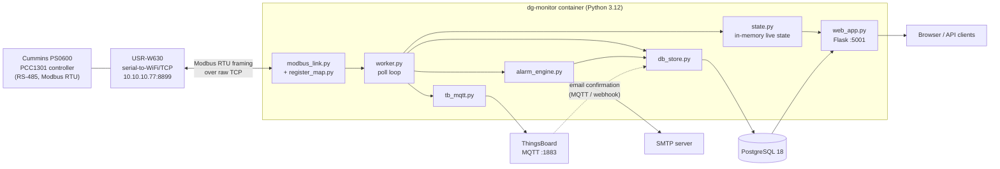

# DG Monitor v2

Real-time monitoring, alarming and cost tracking for a **Cummins PS0600 diesel generator** (PCC1301 controller family) over **Modbus RTU-over-TCP**.

The service polls the generator controller every couple of seconds, stores full telemetry in PostgreSQL, serves a live web dashboard, tracks run sessions and monthly fuel cost, and raises alerts for low fuel and generator start/stop events by SMTP email and through ThingsBoard.

---

## Table of contents

1. [Features](#features)
2. [Architecture](#architecture)
3. [Hardware and prerequisites](#hardware-and-prerequisites)
4. [Repository layout](#repository-layout)
5. [Quick start (Docker Compose)](#quick-start-docker-compose)
6. [Running without Docker](#running-without-docker)
7. [Configuration reference](#configuration-reference)
8. [Modbus register map](#modbus-register-map)
9. [Database schema](#database-schema)
10. [Alarms and notifications](#alarms-and-notifications)
11. [ThingsBoard integration](#thingsboard-integration)
12. [Runtime and fuel-cost KPIs](#runtime-and-fuel-cost-kpis)
13. [HTTP API](#http-api)
14. [Web dashboard](#web-dashboard)
15. [Operations](#operations)
16. [Security hardening checklist](#security-hardening-checklist)
17. [Known issues and roadmap](#known-issues-and-roadmap)
18. [Troubleshooting](#troubleshooting)
19. [Reference documents](#reference-documents)
20. [License](#license)

---

## Features

- **Live telemetry** from 37 Modbus registers: status and fault, three-phase voltage / current / kW / kVAr / kVA, frequency, battery voltage, oil pressure, coolant temperature, engine speed, start attempts and fuel level.
- **Full history in PostgreSQL**, one row per successful poll sweep, with indexes for time-range queries.
- **Run-session tracking**: detects generator start and stop, records duration, estimated fuel used and estimated fuel cost per session.
- **Monthly KPI roll-up**: runtime hours, session count, litres and cost per month.
- **Alarm engine** with de-duplication (one record and one email when an alarm opens, one "Resolved" email when it clears).
- **HTML alert emails** over SMTP, with a telemetry snapshot and an action hint.
- **Selective ThingsBoard publishing**: only genset state and fuel level are sent, so ThingsBoard rule chains can drive their own email alerts.
- **Web dashboard and JSON API** (Flask) with notification bell, acknowledge / mark-read, history charts and monthly KPI charts.
- **Self-healing Modbus link**: reconnects automatically after repeated read failures.
- **Docker-first deployment** with PostgreSQL, health checks and automatic restarts.

---

## Architecture



### How one poll cycle works

1. `modbus_link` reads every register in `register_map.PARAMETERS`, one request per register, and decodes raw values (signed / unsigned, scaling, enums).
2. `worker` decides whether the generator is running: **genset state is "Running" or average engine speed is above 500 rpm**.
3. The in-memory state (`state.dg_state`) is updated. The Flask API reads this for `/api/status`.
4. On a stopped-to-running transition a run session is opened and the `genset_stopped` alarm is cleared. On a running-to-stopped transition the session is closed, costs are computed, and the "Generator Stopped" alert is raised.
5. The telemetry row is inserted into PostgreSQL.
6. Genset state and fuel level are published to ThingsBoard over MQTT.
7. Alarm rules are evaluated (see [Alarms](#alarms-and-notifications)).
8. The worker sleeps for `POLL_INTERVAL` seconds. After 3 consecutive empty sweeps it drops the connection and reconnects.

Threads: the Modbus worker runs in a daemon thread, the MQTT client runs its own network thread, and Flask runs in the main thread.

---

## Hardware and prerequisites

**Hardware**

| Item | Notes |
|---|---|
| Cummins PS0600 generator set with PCC1301 controller | Modbus enabled, slave ID default `1` |
| USR-W630 (or equivalent) serial-to-Ethernet/WiFi converter | Must be in **transparent TCP server** mode. It carries **raw RTU frames**, not Modbus-TCP (no MBAP header) |
| Network path from the monitoring host to the converter | Defaults to `10.10.10.77:8899` |

**Software**

- Docker and Docker Compose v2 (recommended), **or** Python 3.10+ and a PostgreSQL server.
- A ThingsBoard instance (optional, for the ThingsBoard alert path).
- An SMTP relay (optional, for direct email alerts).

**Python dependencies** (`requirements.txt`)

```
Flask==3.0.3
Flask-Cors==4.0.1
pymodbus==3.14.0
psycopg2-binary>=2.9.9
paho-mqtt==2.1.0
```

---

## Repository layout

```
DG_Monitor_v2/
├── main.py                # Entry point: DB pool, MQTT, worker thread, Flask
├── worker.py              # Poll loop, run-session tracking, alarm evaluation
├── modbus_link.py         # Modbus RTU-over-TCP client (pymodbus)
├── register_map.py        # Register table, enums, decode helpers
├── alarm_engine.py        # Alarm rules, HTML email alerts, de-duplication
├── db_store.py            # PostgreSQL access layer (pool, telemetry, sessions, alarms, KPIs)
├── tb_mqtt.py             # ThingsBoard MQTT client (selective publish + confirmations)
├── web_app.py             # Flask app: JSON API and embedded HTML dashboard
├── state.py               # Shared in-memory state and lock
├── config.py              # All settings, read from environment variables
├── schema.sql             # PostgreSQL schema, seed asset, views
├── Dockerfile             # python:3.12-slim image
├── docker-compose.yml     # PostgreSQL + application stack
├── requirements.txt
├── .dockerignore / .gitignore
├── Cummins-PowerCommand--modbus-register-mapping.pdf   # Vendor register reference
├── PSO 600 Commissioning Guidelines.pdf                # Vendor commissioning guide
└── dg_monitor_backup.backup                            # Database backup file (see security notes)
```

---

## Quick start (Docker Compose)

```bash
git clone https://github.com/2026dts/DG_Monitor_v2.git
cd DG_Monitor_v2

# 1. Edit docker-compose.yml (or move settings to a .env file, see below)
#    At minimum set: USR_IP, DB_PASSWORD, TB_* (or leave ThingsBoard unreachable),
#    SMTP_* and ALERT_RECIPIENTS.

# 2. Build and start
docker compose up -d --build

# 3. Check
docker compose ps
docker compose logs -f dg-monitor
curl http://localhost:5001/api/status
```

Open the dashboard at **http://localhost:5001**.

What the stack does:

| Service | Image | Purpose |
|---|---|---|
| `postgres` | `postgres:18.6-alpine` | Stores telemetry, sessions, alarms, KPIs. Data persists in `./data`. `schema.sql` is mounted into `docker-entrypoint-initdb.d` for first-run initialisation. Health check: `pg_isready`. |
| `dg-monitor` | Built from `Dockerfile` | The application. Waits for a healthy database, exposes port `5001`, health check calls `/api/status`. |

The application also creates the schema itself if the `dg_assets` table is missing, so it works against an empty database even without the `initdb` mount.

### Keep secrets out of the compose file (recommended)

Create `.env` (never commit it):

```dotenv
USR_IP=10.10.10.77
USR_PORT=8899
SLAVE_ID=1

DB_NAME=dg_monitor
DB_USER=dg_user
DB_PASSWORD=change-me

TB_HOST=10.10.10.52
TB_PORT=1883
TB_ACCESS_TOKEN=<your-thingsboard-device-access-token>

SMTP_HOST=smtp.example.com
SMTP_PORT=587
SMTP_USER=alerts@example.com
SMTP_PASSWORD=<smtp-password>
SMTP_FROM=DG Monitor <alerts@example.com>
ALERT_RECIPIENTS=engineer@example.com,ops@example.com
```

Then reference it from the `dg-monitor` service:

```yaml
    env_file: .env
```

and remove the matching inline values under `environment:`. Do the same for `POSTGRES_PASSWORD` on the `postgres` service so both containers use the same password.

---

## Running without Docker

```bash
python -m venv .venv
source .venv/bin/activate            # Windows: .venv\Scripts\activate
pip install -r requirements.txt

# Prepare the database (once)
createdb dg_monitor
psql dg_monitor -f schema.sql        # optional: the app also does this on first start

# Configure via environment variables (see the table below), for example:
export USR_IP=10.10.10.77
export DB_HOST=localhost DB_USER=dg_user DB_PASSWORD=change-me DB_NAME=dg_monitor
export TB_ACCESS_TOKEN=<token>

python main.py
```

On start-up the console prints a banner with the converter address, slave ID, database and web URL. If PostgreSQL cannot be reached the process exits immediately.

---

## Configuration reference

All settings are environment variables read in `config.py`. Values shown are the code defaults; the shipped `docker-compose.yml` overrides some of them.

### Modbus / converter

| Variable | Default | Description |
|---|---|---|
| `USR_IP` | `10.10.10.77` | IP address of the USR-W630 |
| `USR_PORT` | `8899` | TCP port of the converter's serial passthrough |
| `SLAVE_ID` | `1` | Modbus slave (device) ID of the controller |
| `TCP_TIMEOUT` | `20` | Socket timeout in seconds |
| `POLL_INTERVAL` | `2` | Seconds to sleep between sweeps |

### Web server

| Variable | Default | Description |
|---|---|---|
| `WEB_HOST` | `0.0.0.0` | Bind address |
| `WEB_PORT` | `5001` | Bind port |
| `DEVICE_NAME` | `DG Status` | Display name |

### PostgreSQL

| Variable | Default |
|---|---|
| `DB_HOST` | `localhost` (`postgres` in compose) |
| `DB_PORT` | `5432` |
| `DB_NAME` | `dg_monitor` |
| `DB_USER` | `dg_user` |
| `DB_PASSWORD` | `dg_password` (change this) |

The connection pool uses 2 to 10 connections.

### Fuel cost model

| Variable | Default | Description |
|---|---|---|
| `FUEL_COST_PER_LITRE` | `96.0` | Price per litre (rupees) |
| `FUEL_CONSUMPTION_LPH` | `8.5` | Assumed consumption in litres per hour, applied to every running hour regardless of load |

### Alarm thresholds

| Variable | Default (`config.py`) | Compose value | Used by an active rule? |
|---|---|---|---|
| `ALARM_FUEL_LOW_PCT` | `30.0` | `20.0` | Yes, low fuel |
| `ALARM_FREQ_MIN_HZ` | `47.0` | `47.0` | Not currently |
| `ALARM_FREQ_MAX_HZ` | `53.0` | `53.0` | Not currently |
| `ALARM_BATT_LOW_V` | `11.8` | `11.8` | Not currently |
| `ALARM_COOLANT_HIGH_F` | `220.0` | `220.0` | Not currently |
| `ALARM_OIL_LOW_PSI` | `20.0` | `20.0` | Not currently |
| `ALARM_EMAIL_COOLDOWN_SECONDS` | `300` | not set | Not currently |

### ThingsBoard

| Variable | Default | Description |
|---|---|---|
| `TB_HOST` | `10.10.10.52` | MQTT broker host |
| `TB_PORT` | `1883` | MQTT port |
| `TB_ACCESS_TOKEN` | (set in code) | Device access token used as the MQTT username. **Supply your own via environment and rotate any token that has been committed.** |
| `TB_USE_TLS` | `False` | Enable TLS |

The client publishes to `v1/devices/me/telemetry` and reconnects with a back-off between 1 and 30 seconds.

### SMTP

| Variable | Default | Description |
|---|---|---|
| `SMTP_HOST` | `smtp.yourdomain.com` | If left at this placeholder, or if `SMTP_PASSWORD` is empty, **no email is sent** |
| `SMTP_PORT` | `587` | |
| `SMTP_USER` | `alerts@yourdomain.com` | |
| `SMTP_PASSWORD` | empty | |
| `SMTP_USE_TLS` | `true` | Uses STARTTLS |
| `SMTP_FROM` | `DG Monitor <alerts@yourdomain.com>` | |
| `ALERT_RECIPIENTS` | `engineer@yourdomain.com` | Comma-separated list |

---

## Modbus register map

Registers are read as **holding registers, one register per request**, from the addresses below. `Address` is the zero-based address passed to pymodbus (`map register - 400001`). The map was checked against the Cummins *Modbus Register Mapping* document (A029X159, Issue 26, chapter 15) included in this repository.

Transport: **Modbus RTU framing over a raw TCP socket** (`ModbusTcpClient` with `FramerType.RTU`). This matches the USR-W630 transparent mode. Do not switch it to the Modbus-TCP framer.

### Status

| Parameter | Map register | Address | Type | Scale | Unit |
|---|---|---|---|---|---|
| Application device type | 400009 | 8 | uint16 | 1 | |
| Control switch position | 400010 | 9 | enum | | |
| Genset state | 400011 | 10 | enum | | |
| Current fault number | 400012 | 11 | uint16 | 1 | |
| Current fault severity | 400013 | 12 | enum | | |

### Voltage and current

| Parameter | Map register | Address | Type | Scale | Unit |
|---|---|---|---|---|---|
| L1-N / L2-N / L3-N voltage | 400018 to 400020 | 17 to 19 | uint16 | 1 | V |
| L1-L2 / L2-L3 / L3-L1 voltage | 400022 to 400024 | 21 to 23 | uint16 | 1 | V |
| L1 / L2 / L3 current | 400026 to 400028 | 25 to 27 | uint16 | 1 | A |
| L1 / L2 / L3 current percentage | 400058 to 400060 | 57 to 59 | uint16 | 0.1 | % |

### Power and frequency

| Parameter | Map register | Address | Type | Scale | Unit |
|---|---|---|---|---|---|
| L1 / L2 / L3 kW | 400031 to 400033 | 30 to 32 | int16 | 1 | kW |
| Total kW | 400034 | 33 | int16 | 1 | kW |
| L1 / L2 / L3 kVAr | 400035 to 400037 | 34 to 36 | int16 | 1 | kVAr |
| Total kVAr | 400038 | 37 | int16 | 1 | kVAr |
| L1 / L2 / L3 kVA | 400040 to 400042 | 39 to 41 | uint16 | 1 | kVA |
| Total kVA | 400043 | 42 | uint16 | 1 | kVA |
| Frequency | 400044 | 43 | uint16 | 0.01 | Hz |

### Engine and fuel

| Parameter | Map register | Address | Type | Scale | Unit |
|---|---|---|---|---|---|
| Battery voltage | 400061 | 60 | uint16 | 0.001 | V |
| Oil pressure | 400062 | 61 | uint16 | 0.1 | psi |
| Coolant temperature | 400064 | 63 | int16 | 0.1 | °F |
| Average engine speed | 400068 | 67 | uint16 | 0.125 | rpm |
| Start attempts | 400069 | 68 | uint16 | 1 | |
| Fuel level | 403745 | 3744 | uint16 | 1 | % |

### Enumerations

| Control switch | Value |
|---|---|
| Off | 0, 123 |
| Auto | 1, 124 |
| Manual | 2, 125 |

| Genset state | Value |
|---|---|
| Off | 0, 123 |
| Stop | 1, 124 |
| Preheat / Precrank / Crank | 2 / 3 / 4 |
| Starter Disconnect | 5 |
| PreRamp / Ramp | 6 / 7 |
| Running | 8, 128 |
| Fault Shutdown | 9 |
| Prerun Setup / Runtime Setup | 10 / 11 |
| Factory Test | 12 |
| Waiting For Powerdown | 13 |
| Ready | 125 |

| Fault severity | Value |
|---|---|
| None / Warning / Shutdown | 0 / 1 / 2 |

Unknown enum values are shown as `Unknown (<raw>)`.

To add a parameter, append a tuple to `PARAMETERS` in `register_map.py`:

```python
("Title", map_register, zero_based_address, "uint16" | "int16" | "enum_*", scale, "unit"),
```

then add a matching column to `dg_telemetry` in `schema.sql` and to `_TELEM_SQL` / `insert_telemetry` in `db_store.py`.

---

## Database schema

Defined in `schema.sql` and created automatically. PostgreSQL only.

| Object | Type | Purpose |
|---|---|---|
| `dg_assets` | table | One row per generator. Seeded with `dg1` ("DG Status", Cummins PS0600 / PCC1301, `10.10.10.77:8899`, slave 1). Designed to extend to several units, although the application currently hard-codes `dg1`. |
| `dg_telemetry` | table | One row per sweep: status text, engine values, fuel, frequency, per-phase voltage / current / kW / kVAr / kVA and totals. Primary key `(id, ts)`. Indexed on `(asset_id, ts DESC)` and a partial index on running periods. |
| `dg_run_sessions` | table | One row per start-to-stop run: start / end, duration, estimated litres, estimated cost, fuel percentage at start and end. |
| `dg_monthly_kpi` | table | Upserted per month when a session closes: runtime hours, session count, litres, cost. |
| `dg_alarms` | table | Alarm episodes: type, severity, opened / cleared / read / notified timestamps, notify count, JSONB `extra` (telemetry snapshot, acknowledgement flag, email confirmation info). |
| `dg_documents` | table | Links to AMC, financial, technical and support documents shown on the dashboard. |
| `dg_latest` | view | Latest telemetry row per asset. |
| `dg_open_alarms` | view | Open alarms with device name. |
| `dg_active_session` | view | The currently running session, if any. |

Rate and growth: at the default 2-second interval this is roughly 43,000 telemetry rows per day. There is no retention or partitioning policy yet; see [roadmap](#known-issues-and-roadmap).

Example queries:

```sql
-- Last 10 readings
SELECT ts, genset_state, fuel_level_pct, total_kw, frequency_hz
FROM dg_telemetry ORDER BY ts DESC LIMIT 10;

-- Runtime and cost this year
SELECT month, runtime_hours, session_count, fuel_used_litres, fuel_cost
FROM dg_monthly_kpi WHERE month >= date_trunc('year', now()) ORDER BY month;

-- Currently open alarms
SELECT * FROM dg_open_alarms;
```

---

## Alarms and notifications

### Active rules

| Alarm type | Label | Severity | Condition |
|---|---|---|---|
| `low_fuel` | Low Fuel Level | critical | Fuel level below `ALARM_FUEL_LOW_PCT` |
| `genset_running` | Generator Started & Running | info | Genset state is "Running" or engine speed above 500 rpm |
| `genset_stopped` | Generator Stopped | info | Raised once by the worker when a running session ends. Cleared on the next start. |

### Lifecycle

1. Each poll, every rule is evaluated. If its condition is true and no open record exists for that type, a row is inserted into `dg_alarms` and an alert email is sent.
2. While the condition stays true nothing further is sent (de-duplication by open record).
3. When the condition becomes false the record is cleared. If it had been open, a green "Resolved" email is sent.
4. On the dashboard, alarms can be **marked read** and **acknowledged**. Acknowledging sets `extra.acknowledged = true`. It does not clear the alarm.

The dashboard and `/api/alarms` only list `low_fuel`, `genset_running` and `genset_stopped`. At start-up, any open alarm of another type is closed.

### Email content

Alert emails are multipart (plain text and dark-themed HTML) with a snapshot of: genset state, control switch, fuel level, frequency, battery voltage, oil pressure, coolant temperature, engine speed and total kW, plus an "Action Required" hint per alarm type. Subjects look like `DG ALARM | Low Fuel Level (<30%)` and `RESOLVED | DG - <label>`.

Emails are skipped silently when `ALERT_RECIPIENTS` is empty, when `SMTP_HOST` is still the placeholder, or when `SMTP_PASSWORD` is empty. Check the logs for `[EMAIL] Sent` or `[EMAIL] Failed`.

### Planned rules (not yet wired in)

The email templates, icons, action hints and configuration thresholds already exist for these, but no rule function is registered for them in `alarm_engine._make_rules()`:

- Frequency out of band (`ALARM_FREQ_MIN_HZ` to `ALARM_FREQ_MAX_HZ`)
- Battery voltage low (`ALARM_BATT_LOW_V`)
- Coolant temperature high (`ALARM_COOLANT_HIGH_F`)
- Oil pressure low (`ALARM_OIL_LOW_PSI`)
- Control switch in Manual

---

## ThingsBoard integration

**Design goal:** keep the ThingsBoard footprint minimal. Everything is stored in PostgreSQL; ThingsBoard receives only what it needs to run alert rule chains.

### Outbound telemetry

Published once per successful poll (QoS 0) to `v1/devices/me/telemetry`:

```json
{
  "Genset state": "Running",
  "Fuel level": 72.0,
  "genset_state": "Running",
  "fuel_level_pct": 72.0
}
```

Authentication uses the device access token as the MQTT username. Publishing is skipped while the MQTT connection is down.

### Email confirmation feedback

The dashboard can show whether a ThingsBoard email went out. ThingsBoard can report back in two ways:

**1. MQTT.** The app subscribes to `v1/devices/me/rpc/request/+`, `v1/devices/me/attributes` and `v1/devices/me/attributes/response/+`. A message such as

```json
{"tb_email_confirmed": "genset_running", "tb_email_time": "..."}
```

is recorded against matching open alarms.

**2. REST webhook.** Configure a *REST API Call* node in the rule chain to call:

```
GET|POST http://<dg-monitor-host>:5001/api/tb/email-sent?alarm_type=low_fuel
```

Optional parameters: `recipients`, `status` (query string or JSON body). Alarm-type matching is a case-insensitive substring match, with fuel and start / stop / running keywords widening the match.

> The two notification paths are independent: the application's own SMTP alerts (`alarm_engine`) and ThingsBoard's rule-chain emails. Run one, or both, depending on your environment.

---

## Runtime and fuel-cost KPIs

For each run session:

```
duration_hours   = (stopped_at - started_at) in hours
fuel_used_litres = duration_hours x FUEL_CONSUMPTION_LPH
fuel_cost        = fuel_used_litres x FUEL_COST_PER_LITRE
```

The session is also added to the monthly roll-up for the month in which it **ended**. Fuel percentage at start and end is stored for reference and cross-checking against the tank level.

Limitations to be aware of:

- Consumption is a fixed constant, not derived from load (`Total kW`) or from the fuel-level drop. Treat cost figures as estimates and tune `FUEL_CONSUMPTION_LPH` to your measured average.
- If the service is not running when the generator stops, that session stays open until the next stop event is observed.

---

## HTTP API

Base URL: `http://<host>:5001`. All responses are JSON. CORS is enabled for all origins.

| Method | Path | Description |
|---|---|---|
| GET | `/` | HTML dashboard |
| GET | `/api/status` | Live values, cards, running flag, connection state, last update, converter details |
| GET | `/api/history?hours=N` | Telemetry time series for charts. `N` is clamped to 1 to 720 (default 24) |
| GET | `/api/monthly?months=N` | Monthly runtime and cost KPIs. `N` is clamped to 1 to 24 (default 12) |
| GET | `/api/alarms` | Alarm history for the last 7 days (open and cleared) |
| POST | `/api/alarms/ack` | Acknowledge. Body `{"id": 12}` or `{"all": true}` |
| POST | `/api/alarms/read` | Mark read. Body `{"id": 12}` or `{"all": true}` |
| GET, POST | `/api/tb/email-sent` | ThingsBoard email-delivery confirmation webhook |
| GET | `/api/documents` | Document links from `dg_documents` |
| GET | `/static/docs/<path>` | Serves files from the application directory (see security notes) |

Examples:

```bash
# Live status
curl -s http://localhost:5001/api/status | jq '{connected, is_running, last_update, values}'

# Last 6 hours of history
curl -s "http://localhost:5001/api/history?hours=6" | jq '.rows | length'

# Acknowledge every open alarm
curl -s -X POST http://localhost:5001/api/alarms/ack \
  -H 'Content-Type: application/json' -d '{"all": true}'
```

`/api/status` shape (abridged):

```json
{
  "connected": true,
  "error": null,
  "is_running": true,
  "last_update": "2026-09-19 10:15:02",
  "last_attempt": "2026-09-19 10:15:02",
  "cards": { "Fuel level": "72 %", "Frequency": "50.00 Hz" },
  "values": { "Fuel level": 72.0, "Frequency": 50.0, "Total kW": 41.0 },
  "usr": { "ip": "10.10.10.77", "port": 8899, "slave_id": 1 }
}
```

---

## Web dashboard

The dashboard is a single self-contained page embedded in `web_app.py` and loaded from the Flask root. It uses Chart.js (with the zoom plugin) from cdnjs, so the browser needs internet access unless you vendor those two scripts.

It presents:

- Header with unit badge, sound toggle, clock and **notification bell** with unread badge and a dropdown of alarms (mark read, acknowledge, acknowledge all, email confirmation status).
- Featured widgets: dynamic **fuel tank**, **control switch** position (Off / Auto / Manual), radial **engine RPM gauge** with running / stopped pill, and output **power and frequency**.
- Live metric cards for electrical and engine parameters with warning / alarm colouring.
- System-health status tiles.
- Time-range charts driven by `/api/history` (zoomable) and monthly runtime / cost charts driven by `/api/monthly`.
- Document links from `/api/documents`.

The page is intended for a local network or to be embedded (it uses a transparent body background).

---

## Operations

### Logs

```bash
docker compose logs -f dg-monitor
docker compose logs -f postgres
```

Log lines are tagged: `[DG]` (worker), `[DB]`, `[EMAIL]`, `[TB-MQTT]`. Log level is `INFO`.

### Backup and restore

The repository contains `dg_monitor_backup.backup`, which appears to be a PostgreSQL dump. Confirm its format before using it.

```bash
# Create a backup (custom format)
docker exec dg-postgres pg_dump -U dg_user -d dg_monitor -Fc > dg_monitor_$(date +%F).backup

# Restore into an empty database
docker exec -i dg-postgres pg_restore -U dg_user -d dg_monitor --clean --if-exists < dg_monitor_YYYY-MM-DD.backup
```

Do not commit backups to the repository; they contain operational data.

### Upgrading

```bash
git pull
docker compose up -d --build
```

The schema is `CREATE ... IF NOT EXISTS`, and the app applies `ALTER TABLE dg_alarms ADD COLUMN IF NOT EXISTS read_at` on start-up. Take a backup before upgrading.

### Health checks

- `dg-monitor`: `curl -f http://localhost:5001/api/status` every 30 seconds.
- `postgres`: `pg_isready` every 10 seconds.

Note that `/api/status` returns HTTP 200 even when the generator link is down; inspect the `connected` and `error` fields to detect a Modbus outage.

---

## Security hardening checklist

This service is designed for a trusted plant network. Before exposing it beyond that, address the following.

- [ ] **Rotate the ThingsBoard access token** and remove any token from `config.py` and `docker-compose.yml`. Anything committed to a public repository should be treated as compromised.
- [ ] **Change the default database credentials** (`dg_user` / `dg_password`) and do not publish the PostgreSQL port.
- [ ] **Remove `dg_monitor_backup.backup` from the repository** and its history if it contains real data.
- [ ] **Restrict `/static/docs/<path>`.** It serves any file under the application directory, which inside the container includes `config.py`. Serve only a dedicated documents folder.
- [ ] **Add authentication** to the dashboard and to the state-changing endpoints (`/api/alarms/ack`, `/api/alarms/read`, `/api/tb/email-sent`). Today none require credentials.
- [ ] **Restrict CORS** from `*` to the origins that actually need it.
- [ ] Put the app behind a **reverse proxy with TLS**, and bind `WEB_HOST` to localhost or an internal interface if the proxy is on the same host.
- [ ] Use `TB_USE_TLS=true` and an authenticated SMTP relay over TLS.
- [ ] Run Flask through a production WSGI server (for example gunicorn or waitress) rather than the built-in development server.
- [ ] Keep `.env` out of version control.

---

## Known issues and roadmap

**Bugs and inconsistencies**

- `docker-compose.yml` appears to begin with a stray line, `cat docker-compose.yml`, above `services:`. Delete it or Compose will reject the file.
- Only 3 of the 6 documented alarm conditions are active (see [Planned rules](#planned-rules-not-yet-wired-in)).
- The low-fuel threshold differs between `config.py` (30), `docker-compose.yml` (20) and the hard-coded label and hint text ("<30%"). Make the label use the configured value.
- `ALARM_EMAIL_COOLDOWN_SECONDS` is defined but not used.
- New alarms are stored with `tb_email_sent = true` and recipients "Divakar & Admin" by default, even when no ThingsBoard email was actually confirmed, so the dashboard can over-report delivery. Store `pending` until a confirmation arrives.
- In `tb_mqtt.py`, the MQTT confirmation path passes `tb_email_time` (a string) to a function that expects a `datetime`, so that path raises and is logged as an error. Parse or ignore the string.
- Startup logic assumes the generator is stopped (`_was_running = False`). A restart while running opens a new session only if none is open; a session left open across a stop while the service was down keeps counting.
- `dg1` is hard-coded in `db_store`, although the schema supports several assets.

**Performance**

- Registers are read one at a time (about 37 round trips per sweep). Batch contiguous ranges (for example addresses 17 to 43 and 57 to 68) to shorten the effective poll interval.
- Alarm evaluation queries the database on every poll for each rule. Cache open-alarm state in memory.
- No retention, downsampling or partitioning of `dg_telemetry`. Consider TimescaleDB or a scheduled purge and a 1-minute roll-up table.

**Ideas**

- Wire in the four planned alarm rules and the Manual-switch warning.
- Estimate fuel use from load or from the fuel-level drop rather than a constant.
- Multi-generator support (loop over `dg_assets`).
- Authentication, role-based acknowledge, audit trail.
- Unit tests for `register_map.decode_value` and the alarm lifecycle; CI to build the image.
- Prometheus metrics endpoint.

---

## Troubleshooting

| Symptom | Likely cause and fix |
|---|---|
| Dashboard shows "not connected", log says `Connection failed: cannot reach <ip>:<port>` | Wrong `USR_IP` / `USR_PORT`, converter offline, or the host cannot route to it. Test with `nc -vz 10.10.10.77 8899`. |
| Connected but every value is "Read error" or no data | Wrong `SLAVE_ID`, baud rate / parity mismatch on the converter, or the converter is not in transparent TCP mode. The controller must be reachable on Modbus RTU. |
| Log shows `No data (fail n/3)` then reconnect | Intermittent RS-485 wiring, termination or timeout problems. Check cabling and increase `TCP_TIMEOUT`. |
| Values wrong by a constant factor | Scale in `register_map.py` does not match your controller firmware. Verify against the Cummins register PDF. |
| Fuel level always 0 or missing | Fuel register 403745 (address 3744) is not populated on your controller configuration. |
| `Cannot connect to PostgreSQL` then exit | Wrong `DB_*` values, database not ready, or password mismatch between the two containers. |
| `DG asset 'dg1' not in DB` | The seed row is missing. Run `schema.sql` again. |
| No emails arrive | `SMTP_HOST` still the placeholder, empty `SMTP_PASSWORD`, empty `ALERT_RECIPIENTS`, or SMTP blocked. Look for `[EMAIL] Failed` in the logs. |
| No data in ThingsBoard | Wrong `TB_HOST` / `TB_ACCESS_TOKEN`, port 1883 blocked, or the log shows `[TB-MQTT] Connect failed`. Publishing is skipped while disconnected. |
| Charts do not load | The browser cannot reach cdnjs. Vendor Chart.js and the zoom plugin locally. |
| `docker compose up` rejects the file | Remove the stray `cat docker-compose.yml` first line. |

---

## Reference documents

- `Cummins-PowerCommand--modbus-register-mapping.pdf`: vendor Modbus register map used to define `register_map.py`.
- `PSO 600 Commissioning Guidelines.pdf`: PS0600 commissioning guide.

---

## License

No license file is present in the repository. Add one (for example MIT or a proprietary notice) before sharing or accepting contributions.
